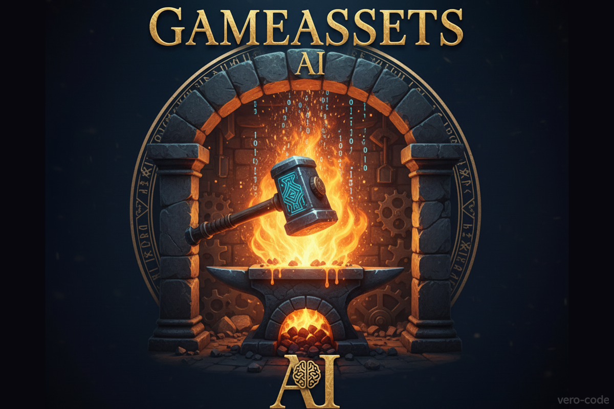

# GameAssets AI ⚔️

[](https://www.python.org/)
[](https://www.gradio.app/)
[](https://fal.ai)
[](https://blackforestlabs.ai/)

An AI-powered forge for indie developers to generate and transform game assets. Upload a base sprite and instantly create endless fantasy variations using the **FLUX.1 Kontext [dev]** model. 

*This project was built for the [Black Forest Labs - FLUX.1 Kontext [dev] Hackathon](https://devpost.com/software/gameassets-ai)*.



🎥 Watch the demo video here: [YouTube link](https://youtu.be/7aJzwBhNUwQ)

## 🚀 Features

  - **Dual Generation Modes:** Choose between two powerful modes for different creative needs. 
  - 🎨 **Inspiration Mode:** Upload a base asset and instantly generate four unique, stylized variations (Fiery, Icy, Ancient, Magic) to spark new ideas. 
  - 🎯 **Single Image Mode:** Take full control by writing a detailed prompt to generate a single, specific asset. 
  - **Interactive UI:** A simple and intuitive web interface built with Gradio. No command line needed. 
  - **Clickable Examples:** Get started immediately by selecting one of the built-in examples (shield, mace, potion, boots).

## 🛠️ Technology & Model

- **Core AI Model:**  **FLUX.1 Kontext [dev]** by Black Forest Labs
- **Cloud Inference:**  **fal.ai** for running the model via API
- **Web Interface:**  **Gradio** for creating the interactive UI
- **Core Language:**  **Python**
- **Key Libraries:**  **Pillow** (for image processing), **Requests** (for handling web data)

## 📦 Installation

Follow these steps to get the application running locally.

### 1. Clone the Repository

```bash
git clone https://github.com/vero-code/gameassets-ai.git
cd gameassets-ai
```

### 2. Create Virtual Environment & Install Dependencies

```bash
# Create and activate the virtual environment 
python -m venv venv 
venv\Scripts\activate 

# Install required packages
pip install -r requirements.txt
```

### 3. Add Asset Examples

Create a folder named `assets` in the project's root directory and download the example images into it.

### 4. Set Up API Key

1.  Get your API key from **fal.ai**.
    
2.  Create a file named `.env` in the project's root directory.
    
3.  Add your key to the file like this:

```
FAL_KEY="your_fal_key_here"
```

## ▶️ Usage

With your environment activated and the `.env` file in place, run the application:

```bash
python src/app.py
```

This will start a local web server. Open the URL provided in the terminal (usually `http://127.0.0.1:7860`) in your web browser to use the app.
  

### 🖍️ Test file

Run test script:

`python src/test_api.py`

It will send a request to FLUX.1 Kontext [dev] and return a generated image URL.
Example output:
`Generated image URL: https://v3b.fal.media/files/...jpg Size: 832 x 448 Inference time: 1.26 seconds`

## 📂 Project structure

```
gameassets-ai/
├─ assets/
│ └─ ...
├─ src/
│ ├─ app.py
│ └─ test_api.py
├─ venv/
├─ .env.example
├─ .gitignore
├─ README.md
└─ requirements.txt
```

## 📄 License

This project is licensed under the **MIT License**.